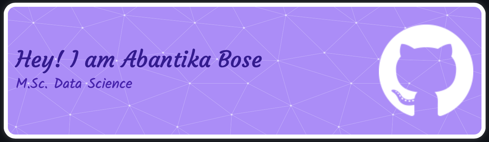

<h1 align="center">Hi there 👋, I'm Abantika Bose</h1>
<h3 align="center">A data science & AI enthusiast with the motivation of deriving meaningful interpretation from complex datasets.</h3>

 

  

 
   

- 🌱 I’m currently studying M.Sc. Data Science (Major in ML/AI) at [Friedrich-Alexander-Universität Erlangen-Nürnberg](https://www.fau.de)

- 🔭 I’m currently working as a Student Research Assistant at [Fraunhofer IISB](https://www.iisb.fraunhofer.de)

- 👨‍💻 All of my projects are available at [https://github.com/Abantika02?tab=repositories](https://github.com/Abantika02?tab=repositories)

- 📫 How to reach me **boseab.abantika@gmail.com**

- ⚡ Fun fact: I love to cook.

<h3 align="left">Skill:</h3>

   </a>  

  

  

  

